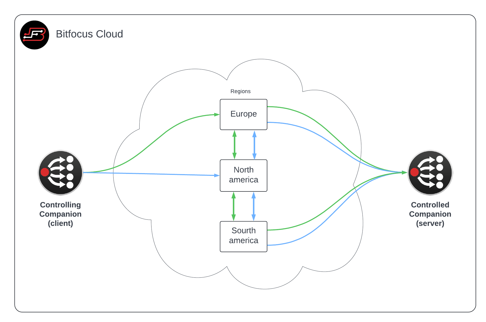

## Bitfocus Companion Cloud

---

Connect to another Companion instance running anywhere in the world using only the "super secret key" of the other Companion instance. (premium service, requires license)

### Cloud redundance

A Companion Cloud client can connect to one or more regions. All commands will be sent to all selected regions at once. The receiving Companion instance does not need to be connected to the same regions, as all messages are automatically relayed internally in the Companion cloud.

This gives you redundant connections both from and to the cloud, even if your internet provider should have problems reaching one of our regions.

If your client only is connected to one region. The receiving Companion, if connected to two regions, will still receive the message on both regions and will send messages to both regions when updating the client.
